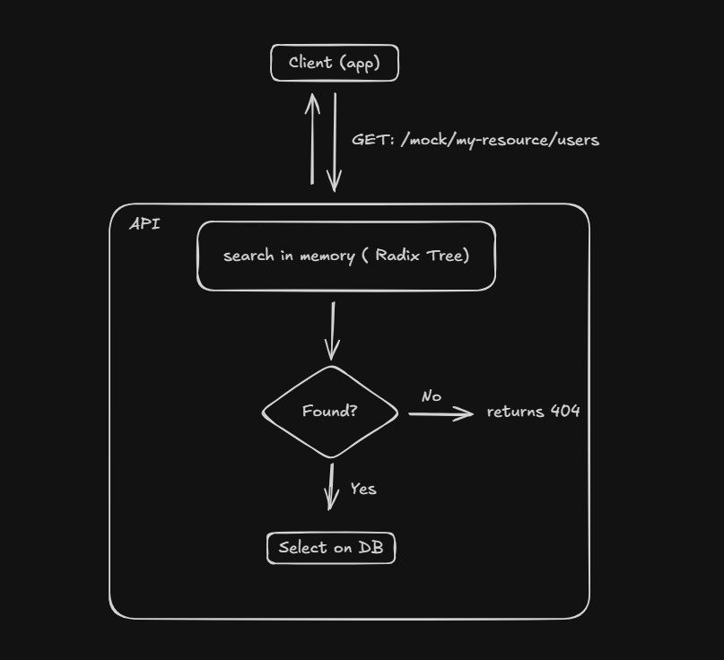

# Demo & Q&A  - POC componente para Mock's
## Versão Alpha 1.0

By: Nathan Berger


---

# Objetivos e Desafios

* Verificar viabilidade de construção de componente genérico que pudesse atender à variedade de endpoints
* Validar comportamento diante de rotas com paths dinâmicos ( Path Params )
* Baixo response time por chamada

---
# Implementação
## Estrutura dos componentes:
```text
(src)
├── mockaqui
├── mockaqui-client
├── mockaqui-lib/demo
```
---
## Overall Design (Radix Tree)



---
# Routing
Rota exclusiva para Mock's
```java
@RestController
@RequestMapping("/mock")
public class EndpointController {

    // ...

    @RequestMapping(value = "/**", method = RequestMethod.GET)
    public DeferredResult<ResponseEntity<?>> getEndpoint() {
        // lógica...
    }
}
```

---

# Routing
Rota exclusiva para API

```java
@RequestMapping("/api")
public class ApiController {

    // ...

    // POST: /api/endpoints
    @PostMapping("/endpoints")
    public ResponseEntity<?> addEndpoint(@RequestBody AddEndpointRequest req) {
        // lógica...
    }
}
```

---

# Demo


---
# Conclusão
## Backlog
* Faker para respostas diferentes
* Histórico de chamadas por cliente, a cada req a resposta pode mudar
* Validação de campos obrigatórios

## Potenciais Problemas
* Alto uso de memória Heap
* Sincronização de dados em memória para mais de um POD up
