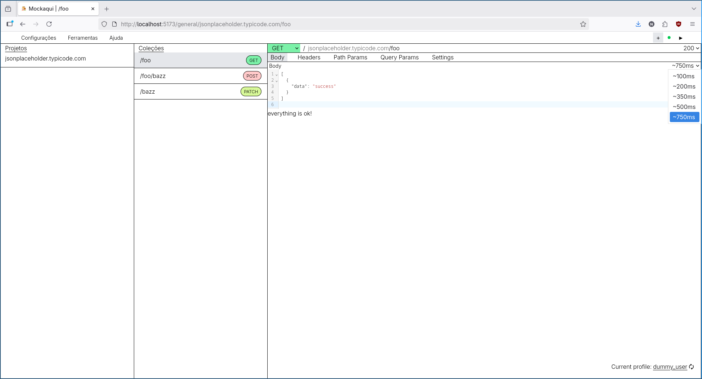
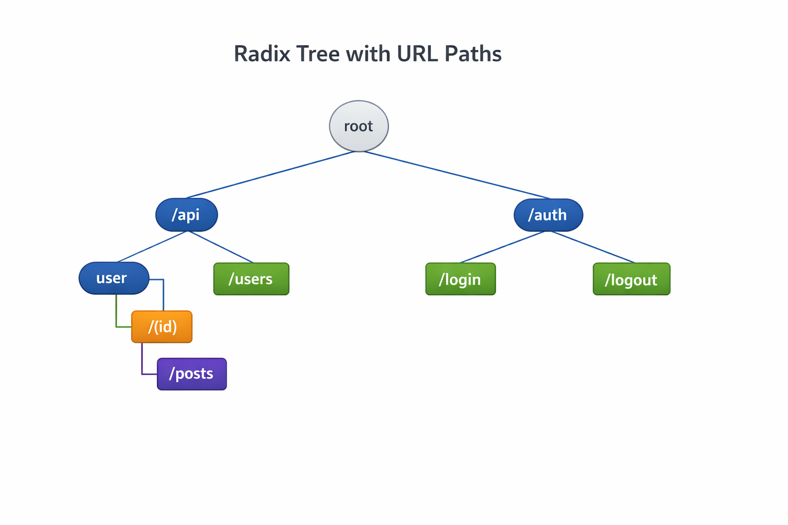

#  POC componente para Mock's

> **Prova de conceito** de um componente genérico em **Java / Spring Boot**
capaz de simular endpoints HTTP de forma dinâmica, sem necessidade de implementações
específicas por rota. O serviço armazena as definições de endpoints em memória
utilizando uma **Radix Tree**, garantindo roteamento eficiente mesmo com path
params variáveis e baixíssimo tempo de resposta por chamada.



By: Nathan Berger

---

## Visão Geral
 
O **Mockaqui** permite que times de desenvolvimento registrem endpoints mockados
via API e os consumam imediatamente, sem deploys adicionais.
O roteamento é feito sobre uma Radix Tree, estrutura que mantém o custo de
busca proporcional ao comprimento do path — e não ao número de rotas registradas
— tornando o componente escalável para grandes volumes de endpoints.

### Motivações da Solução
Durante o ciclo de desenvolvimento é comum enfrentar bloqueios entre times
quando um componente ainda não possui determinado endpoint implementado ou depende
da resposta de outra equipe. O Mockaqui resolve esse problema permitindo que o
desenvolvimento avance em paralelo, sem dependências externas. Durante a homologação,
a ferramenta também se mostra especialmente útil: o QA ganha liberdade para
manipular as respostas e validar todos os cenários possíveis sem depender de
estados específicos do backend. Por fim, em integrações com sistemas de terceiros,
facilita a replicação de respostas em ambientes locais, agilizando o processo de debug.

## Consideracoes

#### Produtividade

- Estimativa de tempo economizado por sprint — quantas horas o time perde hoje esperando endpoints prontos? Mesmo um número aproximado ("~X horas/sprint por dev") tem impacto visual grande.
- Redução de retrabalho em homologação — menos ciclos de correção quando o QA consegue testar todos os cenários antes do deploy.

#### Segurança e controle

- Por rodar localmente/internamente, dados sensíveis de payloads não saem para serviços externos.

#### Facilidade de adoção

- Curva de aprendizado baixa — qualquer dev ou QA consegue registrar um mock via interface web ou Postman sem conhecer o código.
- Não exige mudança de processo, encaixa no fluxo atual.

#### Riscos mitigados

- Ambientes de staging com APIs de terceiros instáveis ou com cota de requisições — o mock elimina esse risco durante o desenvolvimento.

---

# Objetivos e Desafios

* Verificar viabilidade de construção de componente genérico que pudesse atender à variedade de endpoints
* Validar comportamento diante de rotas com paths dinâmicos ( Path Params )
* Baixo response time por chamada

---
# Implementação
## Estrutura dos componentes:
```text
(src)
├── mockaqui
├── mockaqui-client
├── mockaqui-lib/demo
```
---
## Overall Design (Radix Tree)



---
# Routing
Rota exclusiva para Mock's
```java
@RestController
@RequestMapping("/mock")
public class EndpointController {

    // ...

    @RequestMapping(value = "/**", method = RequestMethod.GET)
    public DeferredResult<ResponseEntity<?>> getEndpoint() {
        // lógica...
    }
}
```

# Routing
Rota exclusiva para API

```java
@RequestMapping("/api")
public class ApiController {

    // ...

    // POST: /api/endpoints
    @PostMapping("/endpoints")
    public ResponseEntity<?> addEndpoint(@RequestBody AddEndpointRequest req) {
        // lógica...
    }
}
```

---

### Exemplo de uso rápido
 
```bash
# 1. Registrar um endpoint mockado
curl -X POST http://localhost:8080/api/endpoints \
  -H "Content-Type: application/json" \
  -d '{
    "path": "/users/{id}",
    "method": "GET",
    "statusCode": 200,
    "response": { "id": 1, "name": "John Doe" }
  }'
 
# 2. Consumir o mock
curl http://localhost:8080/mock/users/42
# → { "id": 1, "name": "John Doe" }
```

---

# Conclusão
## Backlog
* Faker para respostas diferentes
* Histórico de chamadas por cliente, a cada req a resposta pode mudar
* Validação de campos obrigatórios

## Potenciais Problemas
* Alto uso de memória Heap
* Sincronização de dados em memória para mais de um POD up

